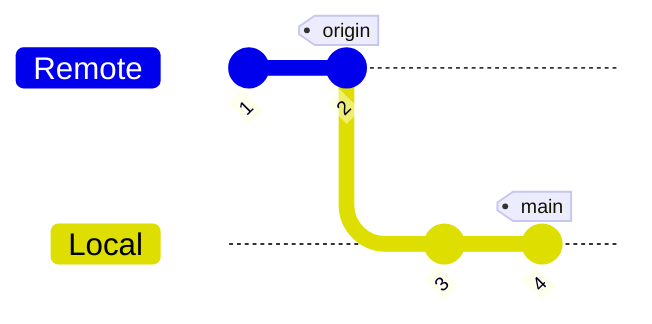
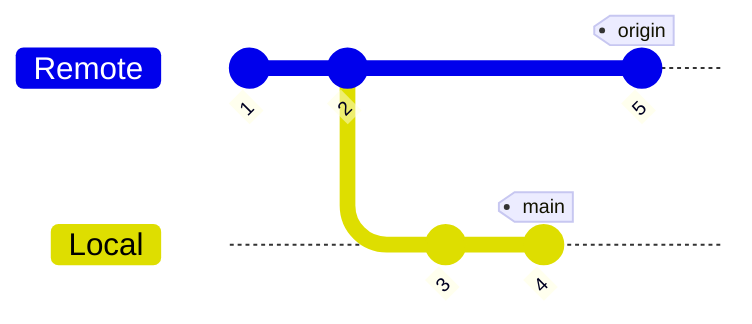
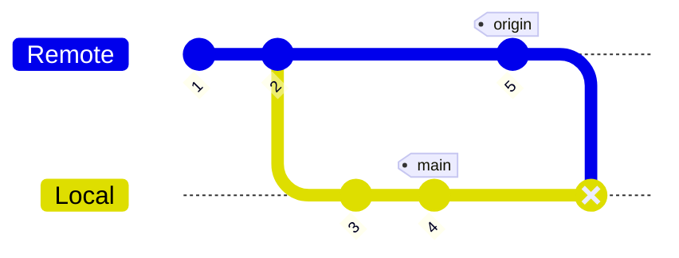
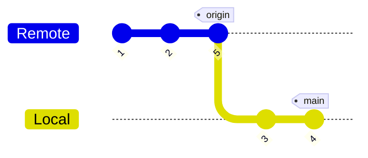

いつも忘れるのでメモ。

ローカルでコミットした後、リモートをプルするときすでにリモートに新しいコミットが作られているとFast forwardが失敗し表題のエラーが発生する。

以下のコマンドでローカルにリモートのコミットを取り込むといい。

```sh
git pull --rebase origin main
```

## 解説

自分は`git config --global pull.ff only`でFast forwardのみを許可しているので以下のような時しか`Remote`から`Local`に`pull`できない。



以下のような時、



Fast forward onlyだと`merge`できない。



`rebase`する必要がある。



## 参考

- [【Git】git pull時のNot possible to fast-forward, aborting.解消法 #Git - Qiita](https://qiita.com/P-man_Brown/items/b316140a02a293a96086)
- [git pull と git pull –rebase の違いって？図を交えて説明します！ – KRAY Inc.](https://kray.jp/blog/git-pull-rebase/)
- [ブランチの統合｜サル先生のGit入門【プロジェクト管理ツールBacklog】](https://backlog.com/ja/git-tutorial/stepup/04/)
